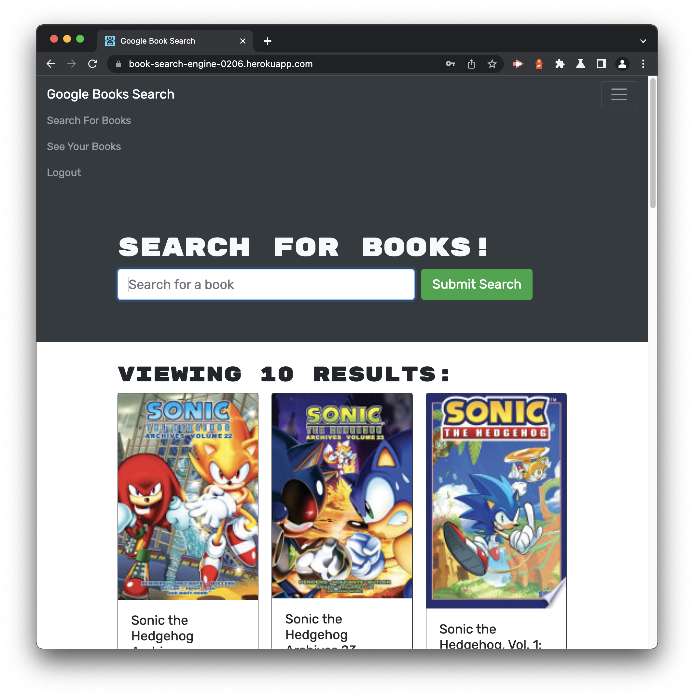
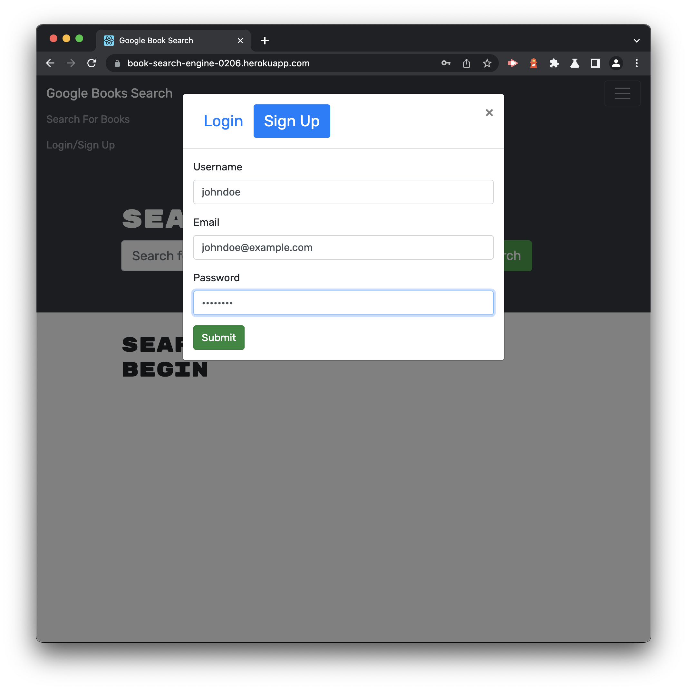
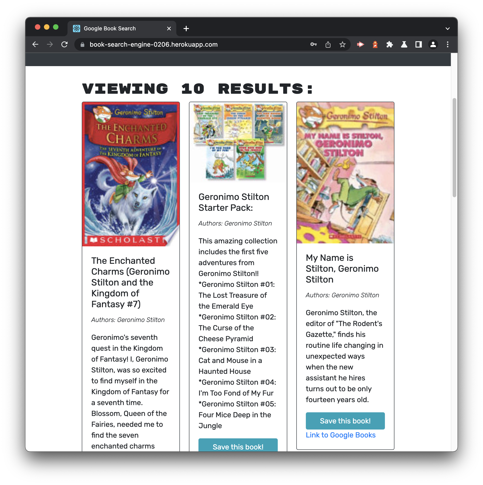

# book-search-engine

 

 

## License

 

[This application is under the MIT license](https://opensource.org/licenses/MIT)

 

## Deployment Link

 

[Deployment](https://book-search-engine-0206.herokuapp.com)

 

☝🏻 Click there!

 

## Table of Contents

 

- [book-search-engine](#book-search-engine)
  - [License](#license)
  - [Deployment Link](#deployment-link)
  - [Table of Contents](#table-of-contents)
  - [Description](#description)
  - [Installation](#installation)
  - [Usage](#usage)
  - [Badges](#badges)
  - [Questions](#questions)
    - [GitHub](#github)
    - [Email](#email)

<small><i><a href='http://ecotrust-canada.github.io/markdown-toc/'>Table of contents generated with markdown-toc</a></i></small>

 

## Description

 

**Book Search Engine** is a Google Books API search engine/GraphQL API built with Apollo Server. It was also built using the MERN stack, with a React front end, MongoDB database, and Node.js/Express.js server and API. **Book Search Engine** uses JSON Web Tokens for authentication: users can search for books but if they wish to save a book they either need to sign up or login in. Once they save a book they can view their saved books on a separate page and can click on links to purchase them on the `Google Books` store.

 

## Installation

 

Clone the repository to your local machine, open your terminal, and navigate to the root folder in the **Book Search Engine** repository. To install the necessary dependencies, run `npm i` in your command-line terminal. Repeat this process two more times, first navigating to the server folder and second navigating to the client folder (running `npm i` both times).

 

## Usage

 

1. To begin using **Book Search Engine**, sign up by entering a username, your email address, and a secure password!

 

 

2. To search for a book simply enter a keyword (or keywords) in the `Search for a book` input field and press the `Submit Search` button.

 

 

3. If you like a book you can press the `Save this book!` book to save it to a page called `See Your Books` (which you can find in the navigation bar). You can also proceed to purchase it on the Google Books store by pressing the link below.

 

 

4. Here we're viewing John Doe's saved books (he's a huge fan of Geronimo Stilton). If he wants to delete a book from his collection all he has to do is press the `Delete this book!` button. Also, when he's tired of browsing for books he can log out (there's a link to log out in the navigation bar at the top).

 

 

## Badges

 

 

 

 

 

 

 

 

 

 

 

 

 

 

 

 

 

## Questions

 

If you have any additional questions, you can reach me at:

 

### GitHub

 

 

[jesterb0206](https://www.github.com/jesterb0206)

 

### Email

 

 

jesterb@seattleu.edu

 
